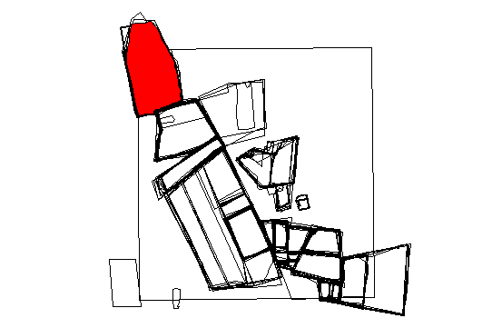
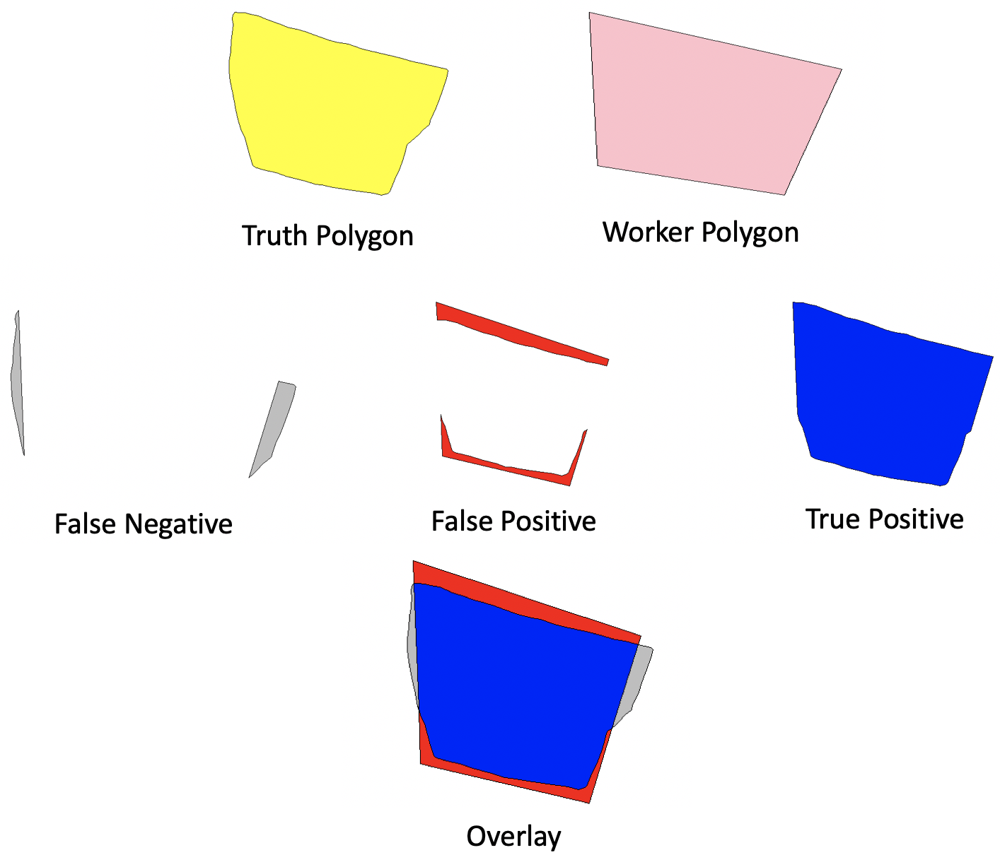
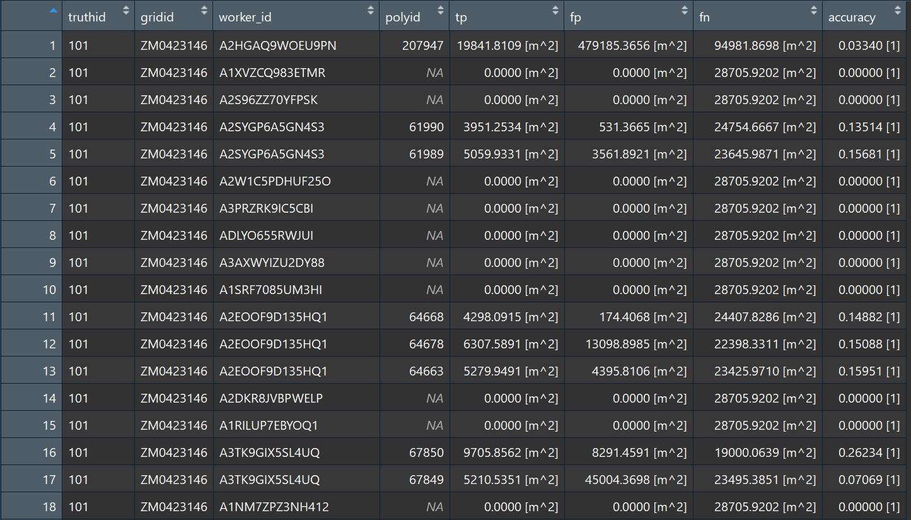

```{r setup, include=FALSE}
knitr::opts_chunk$set(echo = TRUE, comment = "#>")
```

##Summary

####Description

This project is part of the Agroimpacts working group and seeks to use R programming to give accuracy statistics on polygons of farm plots in Zambia which have been created by Amazon Mechanical Turk crowdsourced Workers. Specifically, this project will compare Mechanical Turk polygons to a sampling of ground-truthed polygons to determine the true positive, false positive, and false negative areas of each polygon. The package will consist primarily of a reproducible program which will iterate through all of the ground truth polygons in a file, match them with Mechanical Turk polygons by a common grid value, then for each grid, give the accuracy statistics of each polygon in that grid which intersects with 5% or more of a ground truth polygon.  

These statistics will be useful in understanding the quality of work done by the Mechanical Turk workers and to draw conclusions about how reliable other (unsampled) polygons are, as well as which workers' products are most reliable.

####Primary Objectives
* Objective 1: Successfully iterate and filter through all the features in our datasets to be able to run the accuracy statistics function on each Worker's polygon corresponding with a given truth polygon and with an intersecting area greater than 5% of the truth polygon.

* Objective 2: Adjust (as needed) and integrate elements of functions from the `Rmapaccuracy` package to give accuracy statistics for each worker polygon that corresponds with a sample ground-truthed polygons.

* Objective 3: Report all accuracy statistics to a single `tibble` that shows accuracy statistics for each polygon intersecting with over 5% of a truth polygon, reporting other pertinent information like corresponding truth polygon id, grid id, worker id, and id of polygon being evaluated.

##Existing Code / Packages:
A major component of this project is the accuracy statistics logic, which was derived from the `rmapaccuracy` package (developed by members of the Agroimpacts project).

The map accuracy function creates each of our categories in the following way, which will be key to gathering the statistics:
```{r MapAccuracy Code, fig.width = 6, fig.height = 4, fig.align = "center", error = TRUE, warning = FALSE, message = FALSE, eval = FALSE}
#"truth" is a given truth polygon
#"maps" is a given Mechanical Turks polygon

#True Positive
tp <- st_intersection(truth, maps)  

#False Positive
fp <- st_difference(maps, truth)  

#False Negative
fn <- st_difference(truth, maps)  

#Overall Accuracy
```

The following packages were utilized either directly or indirectly in our final output

* `dplyr`
* `sf`
* `rmapaccuracy` (agroimpacts package)
* `MapAfrica` (repository created by Anela Layugan and used for reference)

##Data

This project relies on three data sets:

* `truth_fmatch.sqlite` - Ground truth polygons, which represent accurate delineations of agricultural fields mapped by a GPS unit
*  `worker_fmaps.sqlite` - Crowdsourced fields digitized by Amazon Mechanical Turk workers
*  `assn.csv` - a `.csv` file with information about Amazon Mechanical Turk workers and their assignments to map particular grids.

The image below shows what the looping structure we have created will compile for a given truth polygon after the first few lines of the script.  This is not actually plotted in the script, but is shown here for visualization purposes.

```{r, out.width = "70%", echo=FALSE, fig.align='center'}

```

Below is an example of how a truth polygon and a worker polygon's geometries are evaluated for accuracy:

```{r, out.width = "70%", echo=FALSE, fig.align='center'}

```

The truth polygon and worker polygon are shonw in yellow and pink, respectively.
False positive areas are shown in red (areas present in worker polygons, but not in their 
truth polygon counterpart). True postive area are shown in blue (shared positive geometry between a worker
and a truth polygon). False negative areas are shown in grey (areas present in truth polygon, but not
in their crowdsourced counterparts). 

## Methodology and Workflow

####Methodology

Our original code relied on a series of for loops that iterated over truth polygons and then attempted to match them with their corresponding mechanical turk assignments with the goal of comparing each valid worker assignment to its corresponding truth polygon.  We worked through about 65% of our workflow before consulting with Professor Estes, where we developed a new workflow approach.  However, the work done with this original workflow allowed us to familiarize ourselves with the data and the iteration and indexing techniques needed for the completion of this project using the second workflow.  

For reference, this incomplete code is included at the end of the document, Appendix 1. 

Some disadvantages of our original approach were:

* excessive and unnecessary comparisons that could have been omitted with more rigorous filtering.
* did not allow for worker specific accuracy assessments, which was an important aspect of the project.
* `for` loops were cumbersome and resulted in excessive code and processing time.

These disadvantages pushed us to adopt a newer approach, which substituted `for` loops with the use of `lapply` and structured the filtering. 
This resulted in:

* more efficient code
* improved readability and reproducibility
* better organization of output data (by worker id so that accuracy of each worker can be analyzed)

####Final Workflow

* Read in datasets with `st_read`
* `Inner join` worker data csv with worker polygons using "assignment_id" field.  This was done in order to relate the "worker_id" field with worker polygons.
* An overarching `lapply` structure iterates through all truth polygons; within this `lapply`:
    + Crowdsourced maps were filtered and matched to their corresponding truth            polygon based on a shared grid id name.
* 2 possible outcomes based on the comparison of worker id to grid:
    + 1)  `wnomaps` <- If a worker is assigned to a grid, but has not mapped anything within it; record true positive and false positive as 0 and false negative as the area of the          truth polygon. 
    + 2)  `wmaps` <- If a worker is assigned to a grid and has mapped something there:
        + Another `lapply` iterated through all of the polygons (by worker id) corresponding with the grid of a given truth polygon
            + a)  if none of their maps intersected the truth polygon, record true positive and false positive as 0 and false negative as the area of the truth polygon. 
            + b)  if there is a valid intersection, determine if the polygon meets the thresholding requirements (intersection area is greater than 5% of the truth polygon),                      calculate the true positive area using `st_intersection`, false negative and false positive area using `st_difference`.
            + c)  if there are multiple unique intersections with the truth polygon, calculate true positive area, false negative and false positive area the same way as above
                + Merge resulting tibbles for 2+ polygons into one using `rbind()`
            + d)  Merge all `tibbles` from these three conditions into one using `do.call(rbind…` at the beginning of `lapply`
* Merge `tibble` from wnomaps and wmamps into a single `tibble` using `do.call(rbind…` at the beginning of the first `lapply` iterating through the truth polygons

`finaldataset` <- the aggregated final output `tibble` with the following data columns:

| Column   | Description                                                                                                                                                       |
|----------|-------------------------------------------------------------------------------------------------------------------------------------------------------------------|
| truthid  | Truth polygon identification number                                                                                                                               |
| gid      | Unique grid identification number                                                                                                                                 |
| workerid | Unique worker identification number                                                                                                                               |
| polyid   | Polygon identification number of a worker polygon that satisfies our threshold of 5% intersected area or above, listed as "NA" for polygons with no intersection. |
| tp       | True positive, intersected area between truth and worker polygon.                                                                                                 |
| fp       | False positive, area present in worker polygon that is not present in truth polygon.                                                                              |
| fn       | False negative, area omitted by worker polygon that is present in truth.                                                                                          |
| accuracy | Percentage of true positive area shared between the worker and the truth polygon                                                                                  |

## Final Code

Below is the final script, which must be read in with the datasets below.  If this does not build directly with the package, the files can be downloaded from our package in "data/CSV Data/" and read locally into the script.

```{r Final Script, fig.width = 6, fig.height = 4, fig.align = "center", error = TRUE, warning = FALSE, message = FALSE, warning=FALSE, eval=FALSE}

library(sf)
library(dplyr)

## DATA MANAGEMENT
# maps made by Mechanical Turk workers
zamworkers_st  <- st_read("data/CSV Data/worker_fmaps.sqlite")

# ground-truth fields
zamtruth_st  <- st_read("data/CSV Data/truth_fmatch.sqlite")

# Worker ids and assignments assignments
zamassn <- read.csv("data/CSV Data/fassignments.csv")

# joining zamassn to worker polys to associate worker ids with polygons
zamworkers_st <- inner_join(x = zamworkers_st, y = zamassn, by = "assignment_id")

# Accuracy Function for use in the final loop
acc_stats_sum <- function(tp, fp, fn) {
  agree <- tp / sum(tp, fn)  # Simple agreement class 1
  if(is.na(agree)) agree <- 0  # Set to 0 if NA
  accuracy <- sum(tp) / sum(tp, fp, fn)
  #TSS <- agree + (tn / (fp + tn)) - 1  # Sens + specificity - 1
  r1 <- round(accuracy, 2)
  out <- c(r1)
  names(out) <- c("accuracy")
  return(out)
}

# Core looping structure

finaldataset <- do.call(rbind,lapply(1:nrow(zamtruth_st), function(x) {
  # x <- 1 (for testing)
  # Initializing
  p <- zamtruth_st[x, ]
  wdat <- zamassn %>% filter(zamassn$name == as.character(p$name))
  wmaps <- zamworkers_st %>% filter(name.x == as.character(p$name)) %>%
    filter(.$worker_id %in% wdat$worker_id)
  wnomaps <- wdat %>% filter(!worker_id %in% wmaps$worker_id)

# accuracy statistics info for all assignments corresponding with each truth poly
  # first tibble for case of worker assigned to grid, but no polygons mapped
  wnomap_stat <- tibble(truthid = p$id, gridid = p$name,
                        worker_id = wnomaps$worker_id, polyid = NA, tp = 0,
                        fp = 0, fn = p %>% st_area(), accuracy = 0)
  # New Lapply to iterate through polygons mapped by workers in a given grid
  temp_wmap_stat <- do.call(rbind, lapply(unique(wdat$worker_id), function(y) {
    # y <- unique(wdat$worker_id)[1] (for testing)
    ipoly <- st_intersects(p, wmaps %>% filter(worker_id == y)) %>% unlist
    wmaps_sub <- wmaps %>% filter(worker_id == y) %>% st_buffer(., 0)
    # first condition for cases of no intersecting polygons with truth polygon
    if(length(ipoly) == 0){
      tp <- 0
      fp <- 0
      fn <- p %>% st_area()
      acc <- 0
      # first tibble summarizing results of first condition
      wmap_stat <- tibble(truthid = p$id, gridid = p$name, worker_id = y,
                          polyid = NA, tp = tp, fp = round(fp, 4),
                          fn = round(fn, 4), accuracy = round(acc, 5))
    } else if(length(ipoly) == 1) {
      # second condition for cases of a single intersection
      tempwmaps <- st_buffer(wmaps %>% filter(worker_id == y), 0)
      iarea <- st_intersection(p, st_buffer(tempwmaps, 0)) %>% st_area()
      # excludes worker polygons that share less than 5% of the truth polygon's area
      if((iarea %>% as.numeric())/(p %>% st_area() %>% as.numeric()) >= 0.05){
        tp <- st_intersection(p, wmaps_sub) %>% st_area() %>% sum(.)
        fp <- st_difference(wmaps_sub, p) %>% st_area() %>% sum(.)
        fn <- st_difference(p, wmaps_sub) %>% st_area() %>% sum(.)
        acc <- sum(tp) / sum(tp, fp, fn)
        # second tibble summarizing the results of this condition
        wmap_stat <- tibble(truthid = p$id, gridid = p$name, worker_id = y,
                            polyid = tempwmaps[ipoly[1],]$gid, tp = tp,
                            fp = round(fp, 4), fn = round(fn, 4),
                            accuracy = round(acc, 5))
      } else{
        # else statement assigns "NA" to polygons which do not meet 5% threshold 
        # to identify them.
        wmap_stat <- tibble(truthid = p$id, gridid = p$name, worker_id = y,
                            polyid = tempwmaps[ipoly[1],]$gid, tp = NA,
                            fp = NA, fn = NA,
                            accuracy = NA)
      }
    } else { # (for testing) if(length(ipoly) > 1){
      # third condition for cases where there are two or more polygons in the same grid
      iterlength <- length(ipoly)
      maxarea <- 0
      tempwmaps <- st_buffer(wmaps %>% filter(worker_id == y), 0)
      wmap_stat <- tibble()
      for (i in 1:iterlength) {
        iarea <- st_intersection(p, st_buffer(tempwmaps[ipoly[i],], 0)) %>%
          st_area()
        if((iarea %>% as.numeric())/(p %>% st_area() %>% as.numeric()) >= 0.05){
          # excludes worker polygons that share less than 5% of the truth polygon's area
          tp <- iarea %>% sum(.)
          fp <- st_difference(st_buffer(tempwmaps[ipoly[i],], 0), p) %>%
            st_area() %>% sum(.)
          fn <- st_difference(p, st_buffer(tempwmaps[ipoly[i],], 0)) %>%
            st_area() %>% sum(.)
          acc <- sum(tp) / sum(tp, fp, fn)
          # third tibble summarizing the results of this condition and appending
          # to any previous iterations
          wmap_stat <- rbind(wmap_stat, tibble(truthid = p$id, gridid = p$name,
                                               worker_id = y,
                                               polyid = tempwmaps[ipoly[i],]$gid,
                                               tp = tp, fp = round(fp, 4),
                                               fn = round(fn, 4),
                                               accuracy = round(acc, 5)))

        } else {
          # else statement assigns "NA" to polygons which do not meet 5% threshold 
          # to identify them.
          wmap_stat <- rbind(wmap_stat, tibble(truthid = p$id, gridid = p$name,
                                               worker_id = y,
                                               polyid = tempwmaps[ipoly[i],]$gid,
                                               tp = NA, fp = NA,
                                               fn = NA,
                                               accuracy = NA))
        }
      }
      wmap_stat <- wmap_stat
    }
  }))
  wmap_stat <- rbind(temp_wmap_stat, wnomap_stat)
}))

View(finaldataset)
```

Here is the first few lines of the output `tibble` generated by this code:

```{r, out.width = "120%", echo=FALSE, fig.align='center'}

```

##Conclusion / Outcomes

####Outcomes

This script achieved project goals by generating accuracy assessments for Amazon Mechanical Turk worker maps in Zambia using ground truth polygons as a reference. This script could be adapted and used in other crowdsourced digitizing accuracy assessment initiatives and the data captured could be further analyzed to determine the accuracy of each worker, accuracy within each grid or accuracy by polygons of certain size thresholds, to give a few examples.

Our objectives were reached as follows:

* Objective 1: Using `lapply`, we successfully created a structure to filter through both truth polygons and worker polygons intersecting with a given truth polygon's grid, finding every polygon that intersects with more than 5% of the area of the truth polygon in order to run accuracy statistics on each.

* Objective 2: Taking elements of the `map_accuracy` and `acc_stats_sum` functions from the `Rmapaccuracy` package, we successfully integrated accuracy statistics into the looping structure, and were able to capture accuracy statistics on all intersecting polygons.

* Objective 3: Numerous `tibbles` were created at each conditional step of our script, but were bound together into a single tibble by running `do.call()` and `rbind()` at the beginning of each `lapply`.  The result is a single tibble of roughly 12,500 rows.  Pertinent information like truth polygon id, grid id, worker id, and id of polygon being evaluated were captured and included in this `tibble`, along with the accuracy statistics

####Important Note/Consideration

As the looping code is written, we have integrated a thresholding mechanism to exclude polygons which do not meet a threshold of greater than or equal to 5% area intersection with a given truth polygon. Worker polygons intersecting under this threshold were deemed to be erronously intersecting the truth polygon. 
This means that no accuracy statistics are reported in the `tibble` for these polygons, even though other "misses" (including `wnomaps` and cases where a worker mapped a polygon but it did not intersect with the truth polygon were recorded as false negatives with an area that equalled the area of the truth polygon (a full false negative or "miss")).  Because these excluded polygons did not truly have the false negative area of the full truth polygon, we did not feel comfortable reporting that number as the statistic, but also did not want to report full accuracy statistics as these polygons are likely error and this would defeat the purpose of thresholding at all.

We ultimately chose to report the excluded polygons giving only the polygon ID number and reporting "NA"" for all accuracy statistics so that they can be easily identified in the final `tibble` if full accuracy statistics, a false negative reporting, or full exclusion of these polygons is desired, this will only require minor changes to the core looping structure to report these changes.

Please feel free to contact any of the authors for more information or assisstance.

##Appendix

####Appendix 1: Original looping structure for illustration of early workflow

```{r Appendix 1, error = TRUE, warning = FALSE, message = FALSE, warning=FALSE, eval=FALSE}
for (i in 1:nrow(zamtruth_sub)){ 
  if(zamtruth_sub$name[i] %in% zamworkers_sub$name){
    # print(i)
    templength <-
      length(zamworkers_sub[zamworkers_sub$name == zamtruth_sub$name[i], "gid"])
    print(templength)
    # 
    temp <- zamworkers_sub[zamworkers_sub$name == zamtruth_sub$name[i], "gid"]
    print("11111111111111111111111111111111111111")
    # truth polygon that temp intersected with
    temptruth <-
      zamtruth_sub[zamtruth_sub$name==zamtruth_sub$name[i],]
    tempgidlist <- list()
    for (poly in 1:templength) {
      if(gIntersects(spgeom1 = temp[poly,],
                     spgeom2 = temptruth,
                     byid = T)==TRUE){
        # temp[poly,] %>% plot()
        # temptruth %>% plot(col="red",add=TRUE)
        # print("haha")
        tempgidlist <- tempgidlist %>%
          append(polygons(temp[poly,]))
        
      }
      else{
        message("no intersection")
      }
      
      # print("2222222222222222222222222222222222222")
      print(tempgidlist)
    }
  }
}
```

