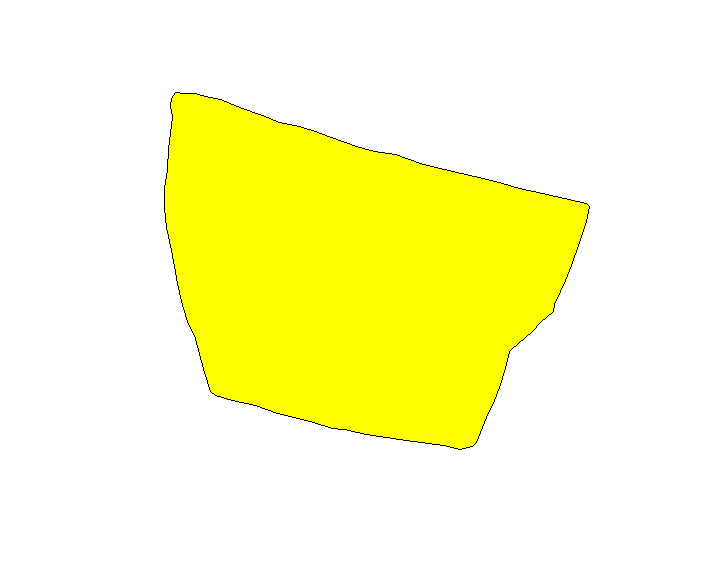
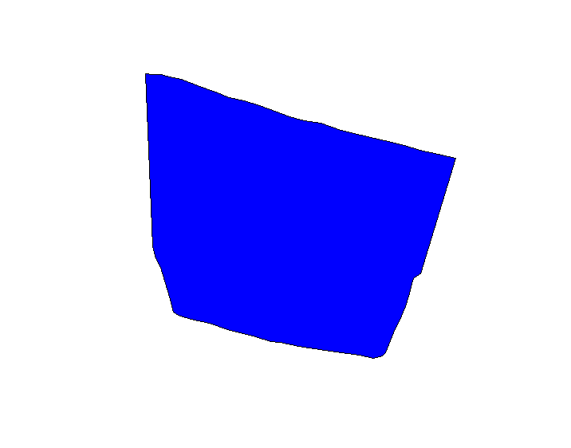
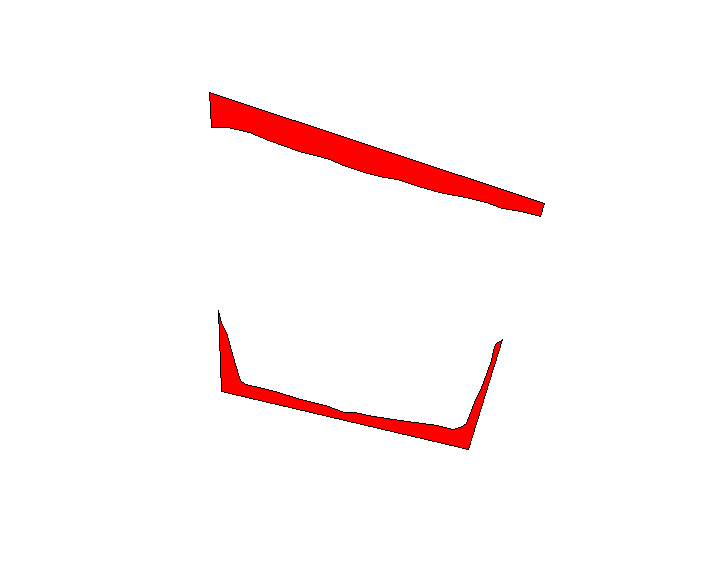
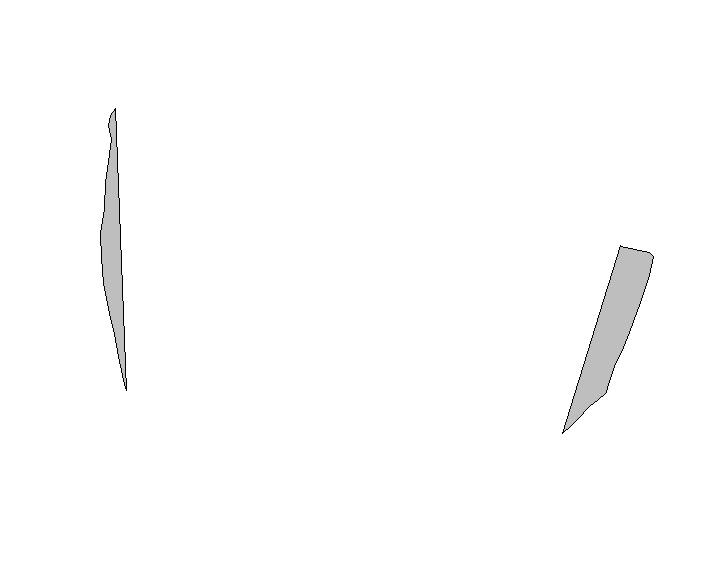
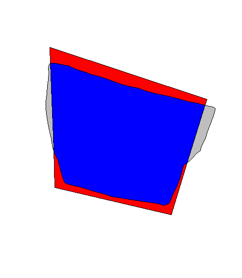

```{r setup, include=FALSE}
knitr::opts_chunk$set(echo = TRUE, comment = "#>")
```
Aaron Eubank, Miles Weule-Chandler, Zhenhua Meng

## Summary: 
(ade)

##### Description

This project is part of the Agroimpacts working group and seeks to use R programming to give accuracy statistics on polygons of farm plots in Zambia which have been created by Amazon Mechanical Turk crowdsourced Workers. Specifically, this project will compare Mechanical Turk polygons to a sampling of ground-truthed polygons to determine the true postive, false positive, and false negative areas of each polygon. The package will consist primarily of a reproducible program which will iterate through all of the ground truth polygons in a file, match them with Mechanical Turk polygons by a common grid value, then for each grid, give the accuracy statistics of each polygon in that grid which intersects with the majority of a ground truth polygon.  The program will also give the compiled statistics for each grid. 

These statistics will be useful in understanding the quality of work done by the Mechanical Turk workers and to draw conclusions about how reliable other (unsampled) polygons are, as well as which workers' products are most reliable.

##### Primary Objectives
* Objective 1: Successfully iterate and filter through all the features in our datasets to be able to run the accuracy statistics function on each polygon.

* Objective 2: Adjust (as needed) and integrate fuctions from the `Rmapaccuracy` package to give accuracy statistics for each worker polygon that corresponds with a sample ground-truthed polygons.

* Objective 3: Report all accuracy statistics to a separate data frame that will show accuracy for each polygon and give overarching statistics for each grid, as well as statistics overall for the entire dataset.

## Approach and Method:
(ade)

An outline of the analytical methods and code you plan to use, including the names of key packages that you will draw on. 

* Methods(ade): 
Geospatially, the main analytical method here will be traditional geoprocessing techniques including intersection and differencing, which will give the areas that each polygon overlaps. Otherwise, this is primarily an algorithmic problem, so looping, lapply, and tidyverse functions  will be used to iterate, filter, and subset our data to find the accuracy statistics of each polygon.

Simple statistical methods for determining accuracy will also be used to get the final results (see chunks below).

* Approach & Existing code / Packages (ade):
A major component of this project will be the `rmapaccuracy` package (developed by members of the Agroimpacts project), which contains at least one main function of interest, called `mapaccuracy` as well as other functions which may be useful.

The map accuracy function creates each of our categories in the following way, which will be key to gathering the statistics
```{r MapAccuracy Code, fig.width = 6, fig.height = 4, fig.align = "center", error = TRUE, warning = FALSE, message = FALSE, eval = FALSE}
#"truth" is a given truth polygon
#"maps" is a given Mechanical Turks polygon

#True Positive
tp <- st_intersection(truth, maps)  

#False Positive
fp <- st_difference(maps, truth)  

#False Negative
fn <- st_difference(truth, maps)  
```

From there, the area will be taken of each of these values and returned as a list using this code:
```{r Statistics area, fig.width = 6, fig.height = 4, fig.align = "center", error = TRUE, warning = FALSE, message = FALSE, eval = FALSE}
acc_stats <- acc_stats_sum(tp = areas["tp"], fp = areas["fp"], 
                             fn = areas["fn"], tn = areas["tn"])

return(list("stats" = acc_stats, "tp" = tp, "fp" = fp, "fn" = fn, "tn" = tn))
```

The following other packages will likely also be utilzed:

* tidyverse
* sf
* sp
* rgdal

##Data: 
(mfwc)

This project relies on three data sets. Ground truth polygons, which represent accurate delineations of
agricultural fields mapped by a GPS unit, crowdsourced fields produced by mechanical turk workers and a 
grid network provided by Mapping Africa.

Truth Polygon: 

```{r, out.width = "50%", echo=FALSE, fig.align='center'}

```

```{r Sample Data, fig.width = 6, fig.height = 4, fig.align = "center", error = TRUE, warning = FALSE, message = FALSE, warning=FALSE, echo=FALSE, eval=FALSE}

library(sf)
library(sp)
library(raster)
library(rgdal)
library(rgeos)
library(maps)
library(farmapz)
library(rmapaccuracy)

truth_sub <- st_read("C:/Users/euban/OneDrive - Clark University/Geospatial Analysis with R/packages/geospaarproj/farmapz/data/CSV Data/truth_sub.sqlite")

workers_sub <- st_read("C:/Users/euban/OneDrive - Clark University/Geospatial Analysis with R/packages/geospaarproj/farmapz/data/CSV Data/workers_sub.sqlite")

grids_sub <- st_read("C:/Users/euban/OneDrive - Clark University/Geospatial Analysis with R/packages/geospaarproj/farmapz/data/CSV Data/grids_sub.sqlite")

# example truth polygon
example_t_polygon <- truth_sub[truth_sub$ogc_fid0 == "420",]

# example mechanical turk worker polygon
example_worker_polygon <- workers_sub[workers_sub$ogc_fid0 == "1908",]

false_positive <- st_difference(example_worker_polygon, example_t_polygon)
true_positive <- st_intersection(example_worker_polygon, example_t_polygon)
false_negative <- st_difference(example_t_polygon,example_worker_polygon)

plot(st_geometry(example_t_polygon))
plot(st_geometry(false_positive), col = "red", add = TRUE)
plot(st_geometry(true_positive), col = "blue", add = TRUE)
plot(st_geometry(false_negative), col = "grey", add = TRUE)
```

False positive areas are shown in red (areas present in worker polygons, but not in their 
truth polygon counterpart). True postive area are shown in blue (shared positive geometry between a worker
and a truth polygon). False negative areas are shown in grey (areas present in truth polygon, but not
in their crowdsourced counterparts). 

True Positive Area:

```{r, out.width = "50%", echo=FALSE, fig.align='center'}

```

False Positve Area:

```{r, out.width = "50%", echo=FALSE, fig.align='center'}

```

False Negative Area:

```{r, out.width = "50%", echo=FALSE, fig.align='center'}

```

Here is a visualization of all three together:

```{r, out.width = "50%", echo=FALSE, fig.align='center'}

```

Our proposed methodology will utilize the mapaccuracy function from the `rmapaccuracy` package to iterate over truth polygons and their associated mechanical turk derived field assignments. The three characteristics described above will then be calculated for each mechanical turk assignment. Existing methodologies from similar projects will be adapted for use in this project'

## Code: 
(mfwc) 

* Read in three data sources described above using `st_read` (Miles)
* Iterate over truth polygons using looping program created by team (Zhenhua & Aaron)
* Exclude accuracy comparisons between truth polygons and crowdsourced polygons when true positive
areas share less than 50% of the truth polygon's area. (Miles, Aaron, Zhenhua)
* Calculate false negative, false positive and true positive area for each crowdsourced map. (Miles, Aaron, Zhenhua)
* Transfer the statistics to a separate dataframe or list to for final statistics and analysis. (Miles)

## Timelines: 
(zm)

A rough timeline of our project is as follows:

* 04/08/2019 -
Acquire the ground truth polygons data and crowdsourced fields data from Professor Estes via the Geospaarproj package. (Aaron)

* 04/10/2019 -
Explore the data and understand previous work done previously. (All)

* 04/15/2019 -
Read and understand the functions about accuracy assessment. (All)

* 04/19/2019 -
Start the construction of looping structure. (All)

* 4/25/2019 -
Integrate the accuracy assessment functions into the looping struction. (All)

* 4/27/2019 -
Funnel data into a final data frame collated by grid and field with summary statistics. (Miles)

* 04/29/2019 - Create report vignettes for the project:
    + Overview - (Aaron)
    + Report/Results - (Miles)
    + Description/Namespace - (Zhenhua)
    


* 05/03/2019
Submit the project. (Zhenhua)

## Anticipated Outcomes:
(zm)

* Outcome 1:
A looping structure that can iterate and filter through all the features in our datasets.

* Outcome 2:
A statistics function (integrated into the looping structure) which returns the accuracy assessment for each worker polygon that relates to its corresponding truth-polygon.

* Outcome 3:
A data frame that shows the accuracy for each Mechanical Turk polygon and give overarching statistics for each sampling grid, as well as statistics overall for the entire dataset.
